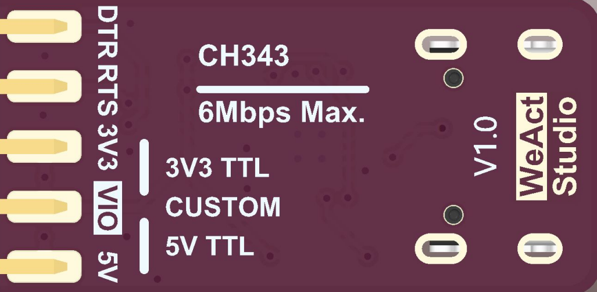

# WeActStudio.USB2SerialV1

USB to serial port module based on CH343P, with RTS and DTR

* Full speed USB device interface, USB 2.0 compatible.
* Support communication baud rate of `50Bps ~ 6Mbps`.
* Optional `3.3V/5V` TTL level input and output, while supporting external setting of target level, level range of `1.8V~5V`.
* Support installation free CDC class built-in operating system drivers or multi-functional high speed VCP vendor drivers.
* CH343P has built-in EEPROM and can be configured with VID, PID, maximum current value, manufacturer and product information string, etc.
* Built-in Unique ID(USB Serial Number).

## I/O Power supply selection

1. When VIO is connected to 3V3 through the short connector cap, the TX/RX/RTS/DTR level is 3.3V.
2. When VIO is connected to 5V through the stub cap, the TX/RX/RTS/DTR level is 5V.
3. When VIO is connected to the power supply of the target device, TX/RX/RTS/DTR is determined by the power supply of the target device, and the level must be in the range of 1.8V to 5V.
4. 5V/3V3 does not have the function of anti-backflow. When the target device is powered on, 5V or 3V3 cannot be connected to the ground.

## Driver install
See the `Drivers` folder