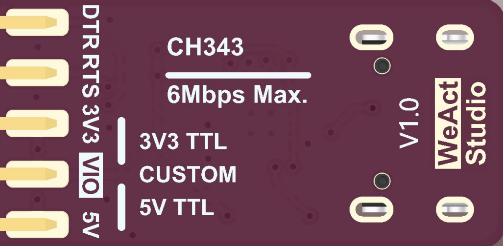

# WeActStudio.USB2SerialV1

基于CH343P的USB转串口模块，带有RTS和DTR

* 全速USB设备接口，兼容 USB 2.0。
* 支持通讯波特率 `50bps～6Mbps`。
* 可选 `3.3V/5V` TTL 电平输入输出，同时支持外部设置目标电平，电平范围`1.8V~5V`。
* 支持免安装的操作系统内置 CDC 类驱动程序或者多功能高速率的 VCP 厂商驱动程序。
* CH343P 内置 EEPROM，可配置芯片 VID、PID、最大电流值、厂商和产品信息字符串等参数。
* 芯片内置 Unique ID(USB Serial Number)。

## 电平选择

1. 当VIO通过短接帽接入3V3时，TX/RX/RTS/DTR电平为3.3V。
2. 当VIO通过短接帽接入5V时，TX/RX/RTS/DTR电平为5V。
3. 当VIO接入目标设备电源时，TX/RX/RTS/DTR由目标设备电源电源决定，电平范围需在1.8V~5V。
4. 5V/3V3 不具备防倒灌功能，当目标设备有电时，不能连接5V或3V3，共地即可。

## 驱动安装
见`Drivers`文件夹